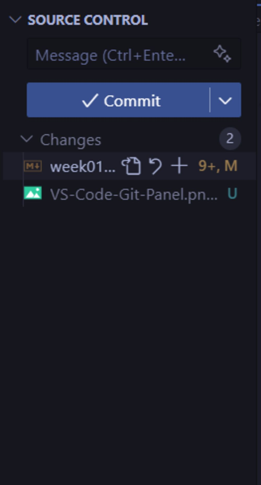
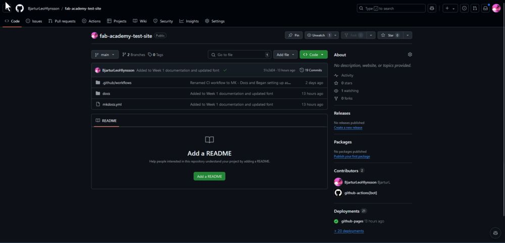
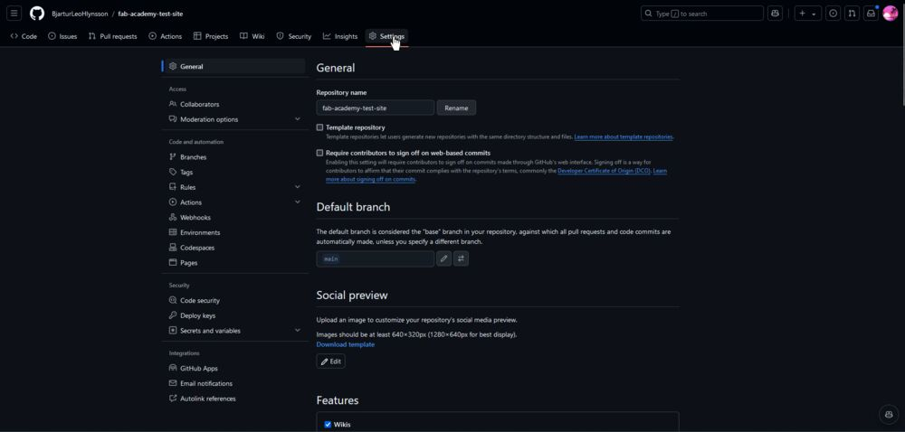
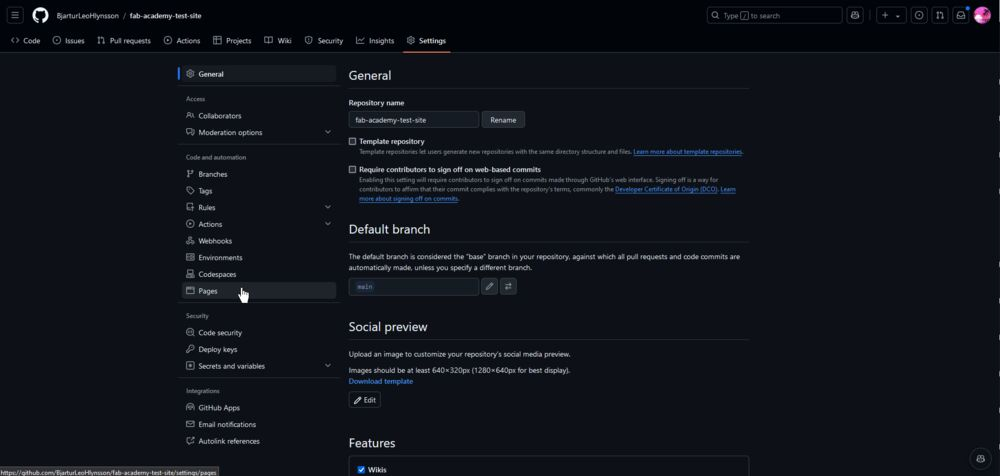
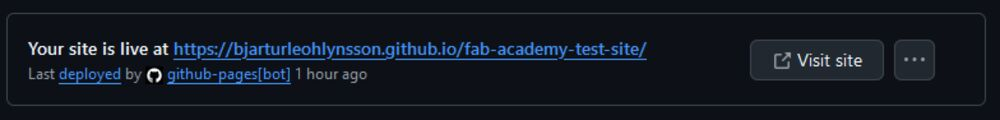
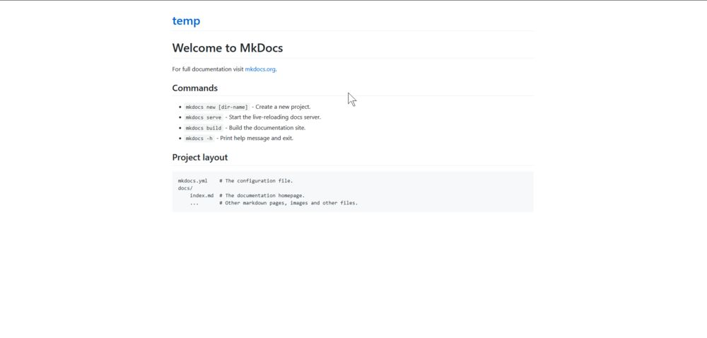
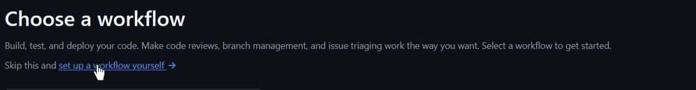
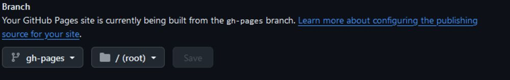
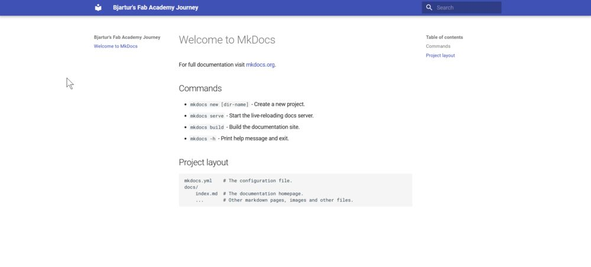

# Website Making

## Assignment

- Set up a documentation website using GitHub.
- Learn to compress all your images and videos

More information can be found on the [🇮🇸 Fab Isa Site](https://www.fabisa.is/N%C3%A1msefni/Pre-Fab/1-heimasidugerd/). 

## Setting Up the Website on GitHub

!!! info "Instructions and Theme"
    I followed these [instructions](https://www.fabisa.is/N%C3%A1msefni/Pre-Fab/1-heimasidugerd/) provided by my instructor [Svavar Konráðsson](https://fabacademy.org/2023/labs/isafjordur/students/svavar-konradsson/index.html), which were very helpful in setting up [MKDocs](https://www.mkdocs.org/). MKDocs is a static site generator that uses Markdown. There are numerous themes available, but I decided to use the [Material](https://squidfunk.github.io/mkdocs-material/) theme.

To get started, I downloaded the following tools:

- [Visual Studio Code](https://code.visualstudio.com/)
- [Python](https://www.python.org/)
- [Git](https://git-scm.com/)

!!! tip "VS Code Extensions"
    In VS Code, I recommend installing [Python](https://marketplace.visualstudio.com/items?itemName=ms-python.python), [Markdown Extension Pack](https://marketplace.visualstudio.com/items?itemName=bat67.markdown-extension-pack), and [YAML](https://marketplace.visualstudio.com/items?itemName=redhat.vscode-yaml). YAML requires a bit more setup to work with MKDocs, which you can find instructions for [here](https://squidfunk.github.io/mkdocs-material/creating-your-site/#minimal-configuration) inside of the note: **_Recommended: configuration validation and auto-complete._**

After installing these tools, I created a repository on [GitHub](https://github.com/) to store my project and host the website using GitHub Pages. On my machine, I created a folder named 'Code' on my C: drive. Within the 'Code' folder, I created a subfolder to store the website files during development.

After completing the setup, I opened VS Code, navigated to the 'Code' folder, and selected my project folder. Next, I needed to install MkDocs, so I opened the terminal and typed:

```bash
pip install mkdocs-material
```

This command installed all the necessary dependencies. Afterwards, I typed:

```bash
mkdocs new .
```

This command created a folder containing all the required resources for MKDocs, which looked like this:

```plaintext
├─ docs/
│  └─ index.md
└─ mkdocs.yml
```

When all that was done, I went into the `mkdocs.yml` file and typed:

```yaml
site_name: Bjartur's Fab Academy Journey

theme:
  name: material
```

This told MKDocs I wanted to use the Material theme. To check everything was successful, I went into the terminal and typed:

```bash
mkdocs serve
```

Then I could open my browser and type [localhost:8000](localhost:8000). That was a local website that I could use to see how my website looks even when coding!

Once I had checked that everything was working, I needed to get the website to GitHub. That was a bit more complicated than I thought, but in the end, it worked. Let's go through how I did that!

To get started, I connected VS Code and Git to my GitHub account. To log in with Git, I needed to open up the terminal and type:

```bash
git config --global user.name "name"
git config --global user.email "email@example.com"
```

After connecting GitHub to VS Code and logging in with Git, I could finally send my page to my GitHub repository. This was done by pressing `Source Control (Ctrl + Shift + G)` on the sidebar, which for me looked a little something like this:

{: style="width:20%"}

Then I just pressed initialize repository in VS Code, chose my repository, and then pressed Commit and finally Sync. My code was now on GitHub. Afterwards, I wanted to get a functional website hosted, so I needed to use GitHub Pages. To begin with, I opened up GitHub, logged in, and opened up my repository. Then I was on this page:

{:style="width:100%"}

Then I needed to deploy my page using GitHub Pages. To configure Pages, I opened up `settings`:

{:style="width:100%"}

In settings, I opened the `Pages` tab:

{:style="width:100%"}

There I configured GitHub to use the main branch and told it to use the root folder which didn't work so afterwards I changed it to the docs folder which worked. That looked a little something like this:


Then I pressed `save` and after around 20 seconds, I reloaded the page and at the top there was a pop-up that looked like this:



Then I could press `Visit Site` but when I checked the site it looked like this:



Which is not correct so I googled why my page looked like that, I was told that I needed to tell GitHub that this is an MKDocs site. To do that, I followed these [instructions](https://squidfunk.github.io/mkdocs-material/publishing-your-site/), which told me I need to make a GitHub "Action". To make a GitHub Action, I went to the top bar and opened up Actions:

In the Actions tab, I pressed  


then I pressed:



Once that was done, I pasted in this code:

```yaml
name: MK-Docs 
on:
  push:
  branches:
    - master 
    - main
permissions:
  contents: write
jobs:
  deploy:
  runs-on: ubuntu-latest
  steps:
    - uses: actions/checkout@v4
    - name: Configure Git Credentials
    run: |
      git config user.name github-actions[bot]
      git config user.email 41898282+github-actions[bot]@users.noreply.github.com
    - uses: actions/setup-python@v5
    with:
      python-version: 3.x
    - run: echo "cache_id=$(date --utc '+%V')" >> $GITHUB_ENV 
    - uses: actions/cache@v4
    with:
      key: mkdocs-material-${{ env.cache_id }}
      path: .cache
      restore-keys: |
      mkdocs-material-
    - run: pip install mkdocs-material 
    - run: mkdocs gh-deploy --force
```

and named it `MK-Docs` and then to save it I pressed `commit`.

Then I went back into the `settings` tab, then `pages`, and selected gh-pages as my branch and root as my folder so it looked like this:



and then my page looked like this:



**Success**! I now had a page that anyone can access and a place to document my journey!

### Configuring and Personalizing my website

To begin, I opened the `mkdocs.yml` file and decided to use Svavar Konráðsson's configuration as a base, customizing it to fit my needs. One of the features I added was the ability to switch between light and dark modes using a light bulb icon next to the search bar. Here is the code for that:

```yaml
theme:
  palette:
    - media: "(prefers-color-scheme: light)"  # Toggle for light mode
      scheme: default
      toggle: 
        icon: material/lightbulb
        name: Switch to dark mode
      primary: black
      accent: red
    - media: "(prefers-color-scheme: dark)"   # Toggle for dark mode
      scheme: slate
      toggle:
        icon: material/lightbulb-outline
        name: Switch to light mode
      primary: black 
      accent: red 
```

Next, I changed the font to enhance the readability of the text and code:

```yaml
# This code should go inside the theme section
  font:
    text: Roboto 
    code: Roboto Mono  
```

I also added several useful Markdown extensions to improve the functionality of the site:

```yaml
markdown_extensions:
  - pymdownx.snippets
  - pymdownx.keys
  - pymdownx.highlight:
      anchor_linenums: true
  - pymdownx.inlinehilite
  - pymdownx.superfences
  - pymdownx.tabbed:
      alternate_style: true
  - pymdownx.details
  - admonition
  - attr_list
  - md_in_html
  - pymdownx.arithmatex:
      generic: true
  - pymdownx.tasklist:
      custom_checkbox: true
```

After making these and a few other minor adjustments like changing the icons, I was extremely pleased with the final result!

## Compressing Images and Video

To get started, I downloaded the following tools:

- [FFmpeg](https://www.gyan.dev/ffmpeg/builds/?ref=winstall)
- [ImageMagick](https://imagemagick.org/index.php)

!!! info "Installing FFmpeg"
    There are two ways to install FFmpeg

    A) Run this command in the terminal on Windows:

    ```bash
    winget install ffmpeg
    ```

    B) Alternatively, you can download the ZIP file from the FFmpeg website linked above.

After installation, I discovered that both FFmpeg and ImageMagick operate without a graphical user interface (GUI), and you must use the terminal to interact with them.

### ImageMagick 
To batch convert images, I opened the image folder in the terminal by typing CMD in the search box. Then, I used the following command to resize and compress all PNG images:

```bash
magick mogrify -resize 1000 -quality 80 -format jpg *.png
```

To convert a single image, I used this command:

```bash
magick IMAGE-NAME.png -resize 1000 -quality 80 output_image.jpg
```

!!! warning
    If ImageMagick is not working, check if you are using the right command by replacing `convert` with `magick` if you are using either Linux or MacOS

### FFmpeg
Similarly, I optimized videos by navigating to the video folder and typing CMD to open the terminal. I then ran the following command, which can be found on [Svavar's Site](https://fabacademy.org/2023/labs/isafjordur/students/svavar-konradsson/assignments/week01.html#video-compression-for-the-web):

```bash
ffmpeg -i input_video.mov -vcodec libx264 -crf 25 -preset veryslow -movflags +faststart -vf scale=-2:360 -c:a aac -b:a 128k output_video.mp4
```

## Last Words

This week was very interesting. I learned about how to use Git and GitHub and MKDocs Material which I am loving as a website maker. This week thought me a lot and i am very happy with my website.

### Design Files

- None

### Important Links

- [GitHub Pages](https://pages.github.com/)

### Software I used

- [Material for MkDocs](https://squidfunk.github.io/mkdocs-material/)
- [Visual Studio Code](https://code.visualstudio.com/)
- [Python](https://www.python.org/)
- [ImageMagick](https://imagemagick.org/index.php)
- [FFmpeg](https://ffmpeg.org/)