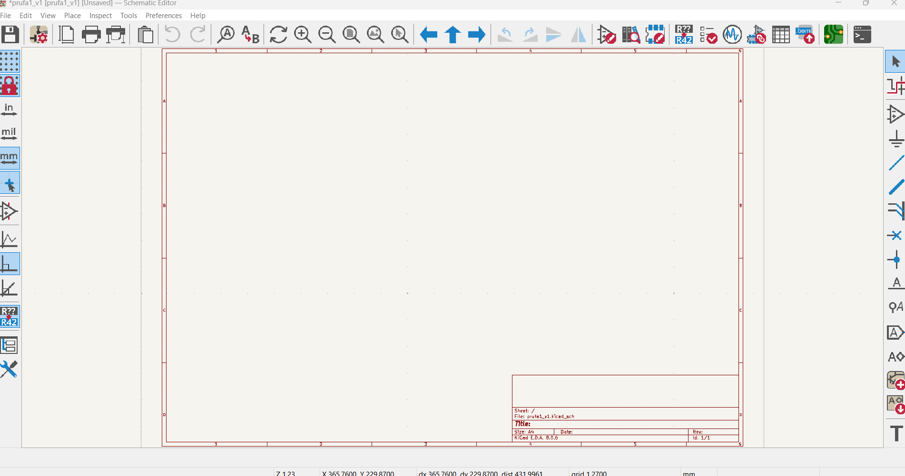
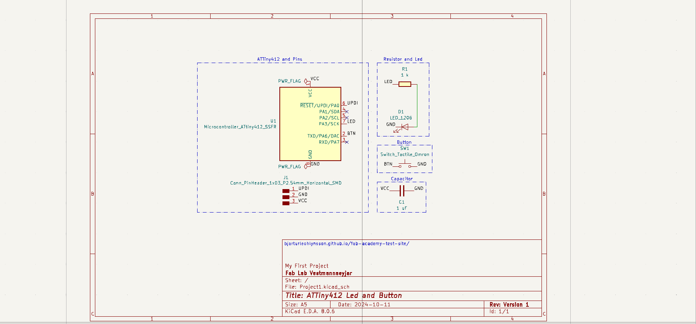

# Electronics Design and Production

## Assignment

- Use KiCad to design a development board to interact and communicate with an embedded microcontroller.
- Make and test the development board you designed.

More information can be found on the [🇮🇸 Fab Isa Site](https://www.fabisa.is/N%C3%A1msefni/Pre-Fab/2-rafrasasmidi/).

### Installing Kicad

To get started, I downloaded the following tools:

- [KiCad](https://www.kicad.org/)
- [Fab Electronics Library](https://gitlab.fabcloud.org/pub/libraries/electronics/kicad)

!!! Tip "Installing Fab Electronics Library in KiCad"
	On the GitLab repo, there are installation instructions:

	- Clone or download the Fab Electronics Library and rename it to fab.
	- Store it in a safe place such as ~/kicad/libraries or C:/kicad/libraries.
	- Run KiCad or open a KiCad .pro file.
	- Go to "Preferences / Manage Symbol Libraries" and add fab.kicad_sym as a symbol library.
	- Go to "Preferences / Manage Footprint Libraries" and add fab.pretty as a footprint library.

We were instructed to watch a YouTube series from Fab Lab Reykjavík, which is linked [here 🇮🇸](https://www.youtube.com/playlist?list=PLs4ifnZzVJmqaSM1lsg68vPVtJxVNhVwV).

After installing these tools, I started by creating a project folder. Then, I opened KiCad, made a project and opened the Schematic Editor.

### The Schematic Editor

I began by adding the following components:

- **ATtiny 412**
- **Switch_Tactile_Omron**
- **C_1206**
- **L_1206**
- **Conn_PinHeader_1x03**

After adding the components, I started by connecting all of them together and then labeled everything. Then, I changed the paper to A5 and labeled it. Finally, I had something that looked like this:

