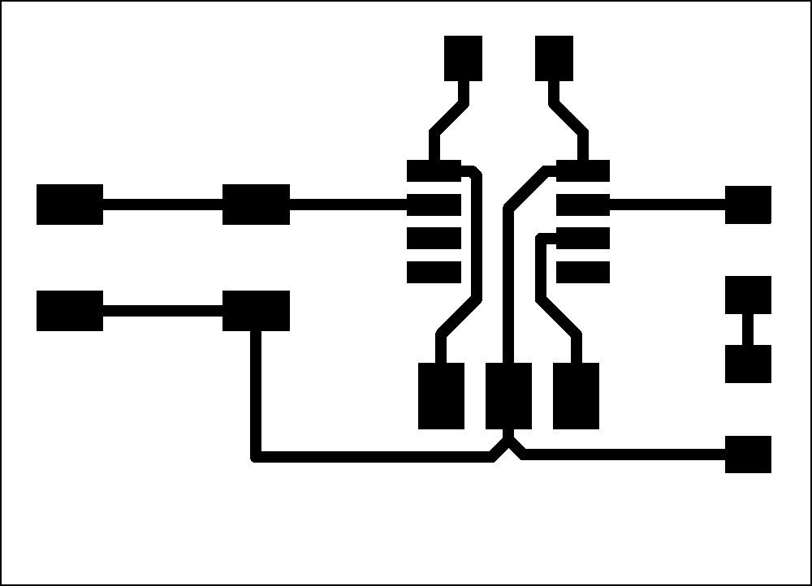

# Electronics Design and Production
## Assignment

- Use KiCad to design a development board to interact and communicate with an embedded microcontroller.
- Make and test the development board you designed.

More information can be found on the [:flag_is: Fab Isa Site](https://www.fabisa.is/N%C3%A1msefni/Pre-Fab/2-rafrasasmidi/).

### Installing KiCad

To get started, I downloaded the following tools:

- [KiCad](https://www.kicad.org/)
- [Fab Electronics Library](https://gitlab.fabcloud.org/pub/libraries/electronics/kicad)
- [Inkscape](https://inkscape.org/)

!!! Tip "Installing Fab Electronics Library in KiCad"
	On the GitLab repo, there are installation instructions:

	- Clone or download the Fab Electronics Library and rename it to fab.
	- Store it in a safe place such as ~/kicad/libraries or C:/kicad/libraries.
	- Run KiCad or open a KiCad .pro file.
	- Go to "Preferences / Manage Symbol Libraries" and add fab.kicad_sym as a symbol library.
	- Go to "Preferences / Manage Footprint Libraries" and add fab.pretty as a footprint library.

We were instructed to watch a YouTube series from Fab Lab Reykjavík, which is linked [:flag_is: here](https://www.youtube.com/playlist?list=PLs4ifnZzVJmqaSM1lsg68vPVtJxVNhVwV).

After installing these tools, I started by creating a project folder. Then, I opened KiCad, made a project, and opened the Schematic Editor.

### The Schematic Editor

I began by adding the following components:

- **ATtiny 412**
- **Switch_Tactile_Omron**
- **C_1206**
- **L_1206**
- **Conn_PinHeader_1x03**

After adding the components, I connected all of them together and labeled everything. Then, I changed the paper to A5 and labeled it. Finally, I had something that looked like this:

### The PCB Editor

**(Needs images)**

Next, I opened the PCB Editor and synced my schematic to the editor by pressing this button:

Then, I arranged the components and started connecting them together following the labels I had made in the Schematic Editor. So I had this:

To finish, I placed a square outline to tell the computer how large the board was supposed to be. Then, I had this which I could use to make the board.

Lastly, as a secondary task, I opened the 3D viewer and assigned all the components 3D models so I could use that as a reference to model a case or something similar in FreeCAD.

### Exporting and Inkscape

Next, I had to export my KiCad board so I could mill it using the circuit mill. I went into export and selected F_CU and exported it as an SVG. Then I did it again but now I only selected Edge_Cuts. Now I had two SVG files that looked like this:

{ width="335" }
{ width="335" }

The second image does include a line around the edge but it is only visible in light mode. Next, I opened up Inkscape and inverted the colors so white was black and black was white. Now I could export it again and I was ready to mill!

### Milling